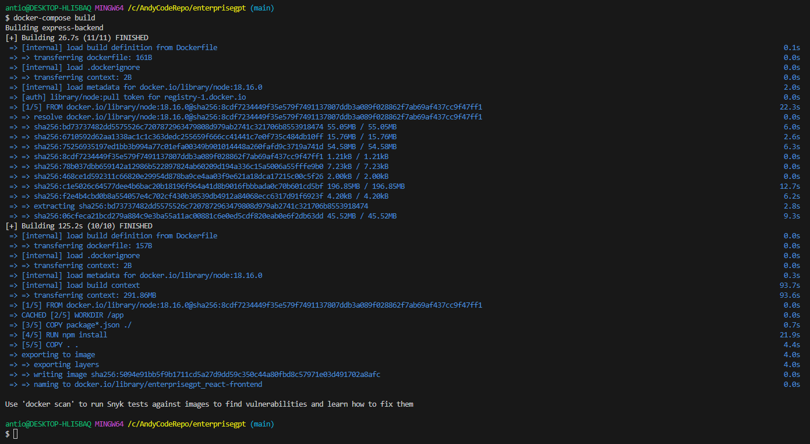

# EnterpriseGPT
EnterpriseGPT is an open-source web application built on top of OpenAI's GPT-4. It's designed for enterprise IT organizations who wish to utilize the AI model while ensuring their source code isn't submitted for analysis. This is achieved through a custom filtering mechanism within the application.

EnterpriseGPT is dockerized for easy deployment and is built using Vite with React and TypeScript for the front-end and Node.js Express for the back-end.

## Prerequisites
Make sure you have the following installed on your machine before proceeding:

- Docker Desktop (version 4.11.0 or higher)

Docker / Docker Compose versioning information
This project uses Docker Compose to run multiple containers as a single service. `Docker Desktop` includes `Docker Compose` along with `Docker Engine` and `Docker CLI`, which are Compose prerequisites.

The `docker-compose.yml` file specifies the `version 3.8` of the Compose file format. This is the latest version of the format and provides a number of advantages such as support for secrets, configs, healthchecks, and more.

For more information on the Compose file format versions and compatibility, please refer to the official documentation.

If you encounter any issues with running this project, you may need to update your `Docker Desktop` to the latest version. You can check for updates by selecting "Check for updates" from the Docker menu.

## Starting the application
1. Clone the repository: 
    ```bash
    git clone https://github.com/in-the-keyhole/enterprisegpt
    cd enterprisegpt
    ``` 
2. Start Docker Desktop: Before you build your Docker images, ensure Docker Desktop is running. Docker Desktop is an application, so you can start it like any other application on your system. For Linux users, Docker service can be started with `sudo systemctl start docker` or `sudo service docker start`.
3. Build the Docker images:
    ```bash
    docker-compose build
    ```
    
4. Run the Docker containers:
    ```bash
    docker-compose up
    ```

Your application should now be running. You can access the frontend at `http://localhost:3000` and your backend at `http://localhost:5000`.

## Project Structure & Deployment
This project utilizes Docker to create and manage the application's environment. Both the front-end and back-end services are dockerized, enabling seamless deployment and scaling.

The back-end service, an Express server, is straightforward to dockerize: its [Dockerfile](../react-frontend/Dockerfile) simply sets up a Node.js environment, installs the necessary packages, and starts the server.

The front-end service, however, requires a slightly different approach due to its use of Vite. Vite provides a development server that optimizes module loading for faster feedback during development. However, it's not designed to be a production server.

To work around this, we use a multi-stage Docker build for the front-end. In this [Dockerfile](../react-frontend/Dockerfile) the first stage uses a Node.js environment to create a production-ready build of the React app with Vite. In the second stage, we use an NGINX server to serve this static build.

This approach allows the front-end service to be effectively dockerized and ensures robustness and performance in production. The [docker-compose.yml](../docker-compose.yml) correctly maps the ports, with the front-end container mapped to port 3000 on your host machine. 

For API calls from the front-end to the back-end, we use http://express-backend:5000 as the base URL. This is because Docker compose creates a default network where containers can reach each other by their service names.

## Back-end documentation
Refer to the `express-backend` [README.md](./express-backend/README.md).

## Front-end documentation
Refer to the `react-frontend` [README.md](./react-frontend/README.md).

## Custom Startup Message for the React Frontend
Refer to the `react-frontend` README.md [Custom Startup Message for the React Frontend](./react-frontend/README.md#custom-startup-message-for-the-react-frontend)

## Contributing
Created and maintained by Keyhole Software on [github](https://github.com/in-the-keyhole).

## License
Refer to the [LICENSE](./LICENSE) document.
